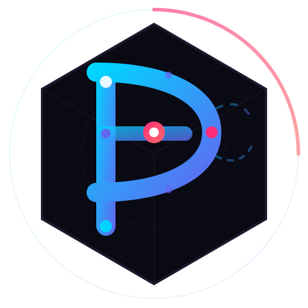

# Picobot

<p align="center">
  
</p>

<p align="center">
  <strong>Your AI agent that works where you work.</strong>
</p>

<p align="center">
  <a href="https://opensource.org/licenses/MIT">
    
  </a>
  <a href="https://python.org">
    
  </a>
</p>

---

## What is Picobot?

Picobot is an AI agent you can talk to anywhere - Telegram, Discord, WhatsApp, or web. It's trained on your context, powered by prompt and context engineering, and ready to help you automate, research, and get things done.

Think of it as having a knowledgeable assistant that's always there, understands your workspace, and can execute tasks on your behalf.

---

## How It Works

You chat with Picobot naturally. Behind the scenes, it uses:
- **Prompt engineering** to understand intent and context
- **Context engineering** to maintain memory across conversations  
- **Tool execution** to take real actions (search, files, git, code)

The magic is in the conversation - no code needed on your end.

---

## Quick Start

### Install

```bash
pip install picobot
```

### Configure

```bash
picobot onboard
```

This creates `~/.picobot/config.json`. Edit it to add your channels:

```json
{
  "channels": {
    "telegram": {
      "enabled": true,
      "token": "YOUR_BOT_TOKEN",
      "allowFrom": ["YOUR_USER_ID"]
    }
  },
  "agents": {
    "defaults": {
      "model": "gemini-2.5-pro",
      "provider": "gemini_oauth"
    }
  }
}
```

### Run

```bash
picobot gateway
```

Now chat with your bot on Telegram!

---

## Commands

| Command | What it does |
|---------|---------------|
| `picobot onboard` | First-time setup |
| `picobot agent -m "..."` | Quick question |
| `picobot gateway` | Start with all channels |
| `picobot status` | Check what's running |
| `picobot doctor` | Diagnose issues |

---

## Setting Up Telegram

1. Message [@BotFather](https://t.me/BotFather) on Telegram
2. Send `/newbot` and follow the prompts
3. Copy the token
4. Send any message to your new bot, then check [@userinfobot](https://t.me/userinfobot) to get your user ID
5. Add both to your config

---

## Supported Models

| Provider | Auth | Notes |
|----------|------|-------|
| **Gemini** | OAuth / API Key | Recommended - use with DAX for OAuth |
| **OpenAI** | API Key | GPT-4, GPT-3.5 |
| **Claude** | API Key | Opus, Sonnet, Haiku |
| **DeepSeek** | API Key | Great for code |
| **Ollama** | Local | Run models locally |
| **Groq** | API Key | Fast inference |
| **Custom** | API Key + URL | Any OpenAI-compatible API |

### Using DAX for Gemini OAuth

DAX handles OAuth authentication for Gemini:

```bash
# Terminal 1: Start DAX
cd /Users/Shared/MYAIAGENTS/dax
python -m dax run

# Terminal 2: Login to Gemini
picobot provider login gemini_oauth
```

---

## What Picobot Can Do

- **Answer questions** - Search the web, read documentation
- **Manage files** - Read, write, organize your workspace
- **Git operations** - Status, commit, push, PR summaries
- **Code tasks** - Write, review, debug code
- **Schedule tasks** - Set up recurring reminders
- **Calendar & email** - Manage your time and communications
- **And more** - Skills can be added to extend capabilities

---

## Architecture

```
┌─────────────────────────────────────────────────────────────┐
│                        Picobot                               │
├─────────────────────────────────────────────────────────────┤
│  Channels     │   Agent     │   Bus      │   Providers    │
│  ─────────    │   ────────  │   ───     │   ──────────   │
│  Telegram     │   Context   │   Queue   │   Gemini      │
│  Discord      │   Memory    │   Events  │   OpenAI      │
│  WhatsApp     │   Skills    │           │   Claude       │
│  Web          │   Tools     │           │   Ollama       │
└─────────────────────────────────────────────────────────────┘
                          │
                    DAX (OAuth + Supervision)
                          │
                    Soothsayer Dashboard
```

---

## Security

Picobot is designed for responsible automation:

- **Shell allowlist** - Only approved commands run
- **Workspace bounds** - File ops stay in your workspace
- **DAX approval** - Sensitive actions need your approval
- **User allowlists** - Only whitelisted users can interact

---

## Configuration

```json
{
  "channels": {
    "telegram": { "enabled": true, "token": "..." }
  },
  "agents": {
    "defaults": {
      "model": "gemini-2.5-pro",
      "provider": "gemini_oauth",
      "temperature": 0.7
    }
  },
  "dax": {
    "url": "http://localhost:3000",
    "workspaceId": "your-workspace-id"
  }
}
```

---

## API

Picobot exposes endpoints for integration:

```
POST /api/picobot/webhook/health      # Health checks
POST /api/picobot/webhook/activity    # Activity sync
GET  /api/picobot/stats              # Get stats
POST /api/picobot/send              # Send message
GET  /api/picobot/commands/pending   # Poll commands
```

---

## Troubleshooting

**Bot not responding?**
```bash
picobot doctor
picobot channels status
```

**Token expired?**
```bash
picobot provider login gemini_oauth
```

---

## License

MIT License - see [LICENSE](LICENSE)
